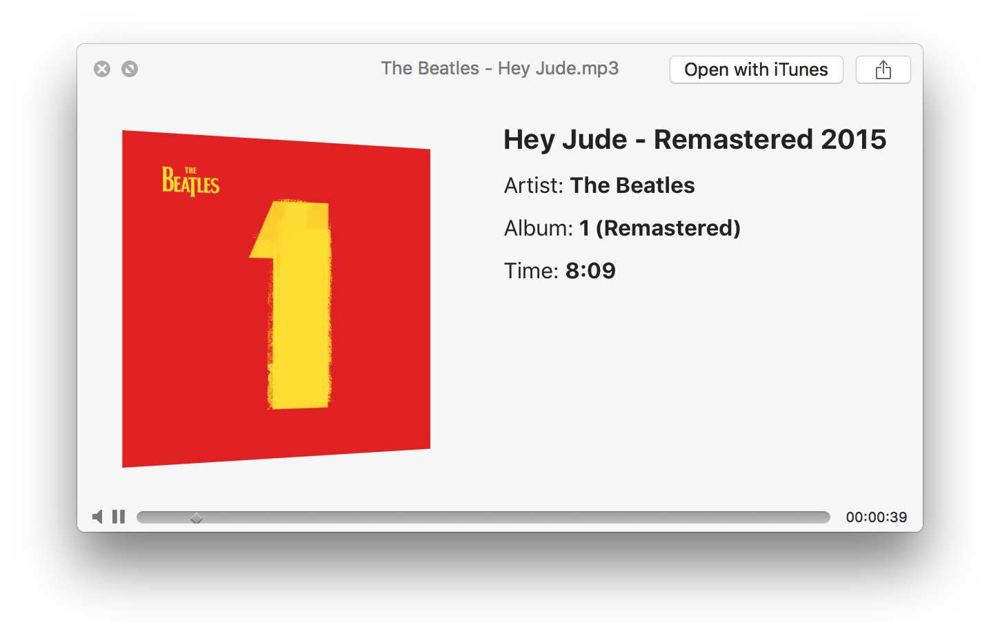

[]()

[](https://badge.fury.io/py/musictools)
[](https://travis-ci.org/kalbhor/MusicTools)

#### Library to download, sort and tag music files

## Social

[](https://github.com/kalbhor/musictools)
[](https://github.com/kalbhor)  
[](https://twitter.com/lakshaykalbhor)


## Dependencies 

### Mac

```sh
$ brew install libav
```

### Ubuntu
```sh
$ sudo apt-get install libav-tools
```

### Windows
[Install libav](https://github.com/NixOS/nixpkgs/issues/5236)


## Installing

#### From Source:

```sh
$ git clone https://github.com/kalbhor/MusicTools
$ cd MusicTools
$ python setup.py install
```

#### From PyPI:
```sh
$ pip install musictools
```
<br>

## Methods

##### Provides a list of youtube videos of the song with urls and titles
```
musictools.get_song_urls(song_name)
```

##### Download song from youtube
```
musictools.download_song(song_url, song_title)
```

##### Provides artist name, song name, album name and album art for a particular song. Requires Client ID and Client Secret for Spotify API
```
musictools.get_metadata(file_name, client_id, client_secret)
```

##### Adds an image as the album art of a mp3 file
```
musictools.add_albumart(file_name, albumart)
```

##### Adds title, artist and album name in a mp3 file

```
musictools.add_metadata(file_name, title, artist, album)
```

##### Removes all metadata and album art from songs

```
musictools.revert_metadata(file_name)
```

##### Returns specified metadata field for a music file

```
musictools.get_current_metadata_tag(file_name, tag)
```


## Example
```sh

>>> from musictools import musictools

>>> songs_list = musictools.get_song_urls("Hey Jude")
>>> print(songs_list[0])
('https://www.youtube.com/watch?v=A_MjCqQoLLA', 'The Beatles - Hey Jude')

>>> url, title = songs_list[0]
>>> print(url)
https://www.youtube.com/watch?v=A_MjCqQoLLA
>>> print(title)
The Beatles - Hey Jude

>>> musictools.download_song(url, title, dl_directory='~/Desktop/Music/')

>>> musictools.get_metadata(title)
('The Beatles', '1 (Remastered)', 'Hey Jude - Remastered 2015', 'https://i.scdn.co/image/9ecfdf528562cae879748b73bd81b64dfa3d5704')

>>> artist, album , song_name, albumart = musictools.get_metadata(title, 'YOUR_CLIENT_ID', 'YOUR_CLIENT_SECRET')

>>> musictools.add_albumart(title, albumart)
>>> musictools.add_metadata(title, song_name, artist, album)

✨✨VOILA✨✨
```
[]()


## Contributing
To contribute, [post issues](https://github.com/kalbhor/MusicTools/issues) without hesitation and [open pull requests](https://github.com/kalbhor/MusicTools/pulls) to add/improve features.

## License 
#### [MIT](https://github.com/kalbhor/MusicTools/blob/master/LICENSE)

